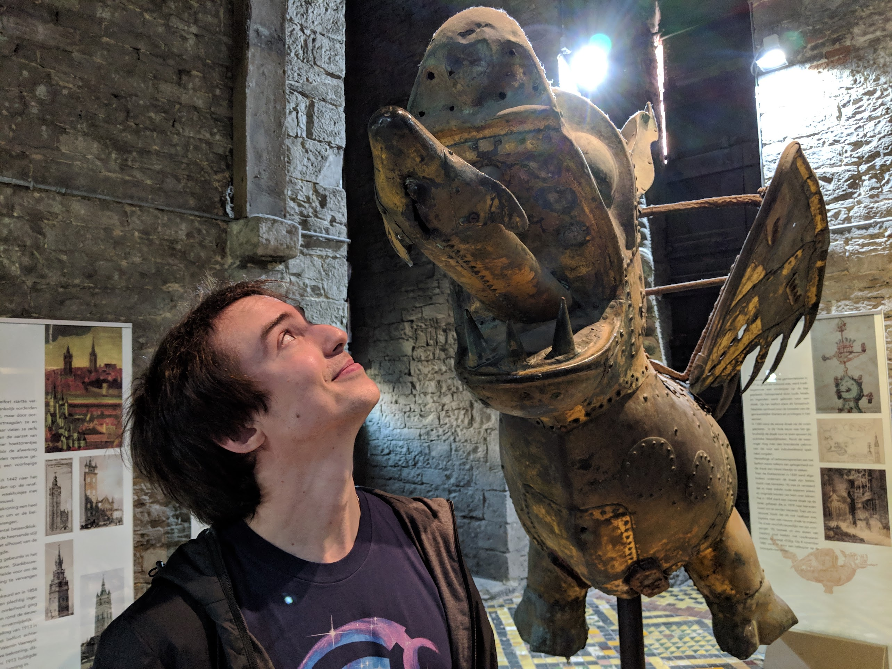

Hello!

I'm a computing scientist and software engineer based in Toronto, Canada.

My main area of work is compilers - in the traditional sense of the word, not
graph compilers - particularly on the front and middle-end, with the
occasional interaction on the back-end; LLVM has been part of my daily routine
for the past four years. As such, most of the content here will be related to
these topics.

The main purpose of this blog is to practice effective technical communication;
if something here is confusing, I'd appreciate if you reached out and let me
know!

You can find me on [Twitter], [LinkedIn] and [GitHub]

[Twitter]: https://twitter.com/fpiovezan
[LinkedIn]: https://www.linkedin.com/in/felipe-de-azevedo-piovezan-a1106ab9/
[GitHub]: https://github.com/felipepiovezan

