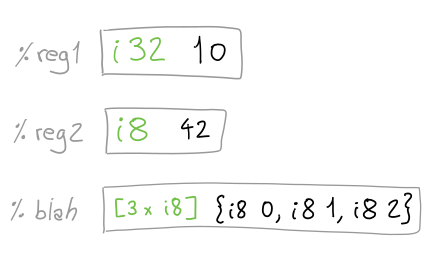
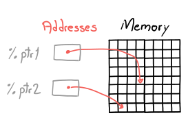

There are three key abstractions on top of which LLVM IR is built: values,
registers and memory.

## Values

In LLVM IR, **a `Value` is a piece of data, and data is described by a type**.
For example, the `Value` `42` of type 32-bit integer is written `i32 42`.

This notion is so important that we will be writing `Value` with a special font
to emphasize that this definition is being used.

## Registers and Memory

There are two places where `Value`s may live: in a register or in memory.

### Registers

A register is an entity that holds exactly one `Value`; `Value`s are placed
into registers through instructions (more on this later). Once a register is
defined, its `Value` - and also its type - never changes.

A register will have a "size" big enough to hold its `Value` regardless of the
`Value`'s type; for example, a register may hold a single integer or even an
entire array.

Registers have _names_, and we use their _name_ to access the underlying `Value`.
Any name starting with the `%` symbol is the name of a register. For example:
`%0, %hi, %___` are all register names.

{style="display:block; margin: auto;"}

The exact name of a register carries no semantic meaning in the program,
registers may be renamed at will.

When working with LLVM IR, we have access to infinitely many registers.

### Memory

Memory is a sequence of bytes, each of which has an address. Addresses, also
known as pointers, are `Value`s and therefore may be placed into a register.

{style="display:block; margin: auto; scale: 150%"}

`Value`s are typically moved from or to memory using loads or stores.

In this characterization, memory is _just_ a sequence of bytes. Memory does not
hold information about the types of `Value`s that were previously stored in it;
it is how we use memory addresses that give meaning (a type) to a sequence of
bytes. We will come back to this when we talk about instructions.

# Registers have Names, Memory has Addresses

Note the difference in the definition of registers and memory: registers have
names but not addresses (registers are _not_ memory locations). Memory does not
have names, only addresses.

This is a core principle, so excuse the repetition: to access a `Value` inside a
register, we use the _register's name_. To access a `Value` in memory, we
use its _memory address_, which may be placed into a register.


# Instructions

Having defined `Values`, registers, and memory, we're now ready to talk about
instructions.

An instruction is an operation that may have `Value`s as input, may define a
register as output, and may modify state in a program (like writing `Value`s to
memory). Each instruction has semantics describing the expected input, the
produced output and changes it makes to the program state ("side effects").

Here's an example instruction:

```llvm
  %result = add i32 10, %two
```

It adds the `Value` `i32 10` and the `Value` inside register `%two`, and defines
(creates) a new register `%result` to hold the resulting `Value`.

LLVM's type system is very strict, the `add` instruction requires both operands
to be `Value`s of the same type. This is statically checked, and the IR is
invalid otherwise.

Instructions can also interact with memory:

```llvm
%address = alloca i32
store i32 %result, i32* %address
```

The `alloca i32` instruction allocates enough memory to contain an `i32` `Value`.
It returns a `Value` corresponding to the address of that memory location, and
that `Value` is placed in the register named `%address`. What is the type of this
`Value`? It is a pointer type: `i32*`.

The second instruction, `store i32`, does not produce a `Value`. It takes the
memory address in the register `%address`, an integer in the register
`%result`, and stores the integer into that memory location.

# Memory Does Not Have a Type!

Recall this paragraph from our memory definition:

> Memory does not hold information about the types of `Value`s that were
> previously stored in it; it is how we use memory addresses that give meaning
> (a type) to a sequence of bytes.

In the case of the `store i32` instruction, it interprets the input address as
a memory region containing a `Value` of type `i32`. In other words, the store
instruction gave meaning (a type) to that address.

One could argue that the type of `%address` also encodes this information; this
is true, but LLVM IR is in a transition period and soon there will be a single
type of pointer: `void*`. For all intents and purposes, we should consider all
pointer types to be the same `void*` type.

# Up Next

In the next post, we will see how a program - functions and global variables -
is structured in LLVM's IR!
