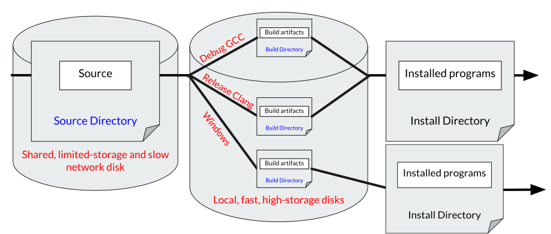
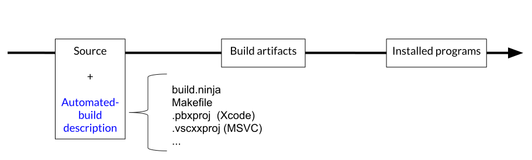

## To Build

Building a project is a two-step process:

1. A set of files is converted into build artifacts.
2. A subset of build artifacts is moved into some installation directory.


The compiler and linker are the main actors in the first step. However, a lot
more than compiling and linking can happen in this stage, like running scripts
to generate code, creating test inputs, testing, generating documentation, etc.

In the second step, some build artifacts are moved into an installation
directory, making the project available to anyone in the system. Often,
developers skip the installation step because they can execute all components
of the project using the build artifacts alone.

The steps above interact with three important directories:

1. Source directory, where source files are located.
2. Build directory, where build artifacts are placed.
3. Install directory, where installed programs are placed.


## In-Source Builds

In some build methods, the source directory and the build directory are the
same, this is known as an __in-source build__:


In other words, source code, scripts and test inputs are all in the same
directory as object files, script-generated code, compiled libraries and
executables, automatically generated documentation, etc.

Consider the implications of this build method:

1. The version control system has to distinguish between files that should be
under version control and files that are build artifacts.
2. Because the build process places files in the same directory where source
code is located, it needs special care not to overwrite or delete important
files.
3. Deleting all build artifacts is non-trivial.
4. Sharing the same source files for different builds is non-trivial.

It's possible to overcome each of those problems at the cost of added
complexity.

## Out-Of-Source Builds

The build method in which the source and build directories are distinct is
called an __out-of-source__ build. The complete separation between source files
and build artifacts makes for a simpler and more practical organization of the
project:

1. A file is under version control if and only if it is inside the source
directory.
2. The build process only outputs files to the build directory, there is no
risk of changing the source files.
3. Deleting build artifacts is simple: `rm -r <build_directory>`.
4. Because the source directory is not aware of the build directory, the same
source can be used for multiple builds.

This last point is so important that it deserves elaborating. Suppose that
running a compiled project in debug mode is expensive, so we don't want to do
it all the time. With out-of-source builds, we can maintain two build
directories, a regular one and a debug one at the same time.

Another application: imagine a scenario where we have to develop an application
on both Windows and Linux. We can place the source directory in network
storage, and maintain build directories in the local (faster) storage of each
system. One build does not affect the other by design.

Another application: suppose that we want to compare the performance of an
application when built with two different compilers. We simply keep two
distinct build directories, one for each compiler.



## Systematically Building

The task of building is so important and complex that a whole set of software
exists for this: build systems. A build system is a description of how to build
a project, combined with a program that reads this description and acts upon
it. Here's the world's simplest build system:

```bash
#build.sh

gcc main.cpp -o main
cp main /my/install/directory
```

In this example, our build system is a shell script that, when invoked,
compiles `main.cpp` and installs the generated executable `main` into
`/my/install/directory`. It is an example of an in-source build because the
build artifact, `main`, is placed in the same location as the source code.

An out-of-source equivalent example would be:

```bash
#build.sh

mkdir $BUILD_DIRECTORY
gcc main.cpp -o $BUILD_DIRECTORY/main
cp $BUILD_DIRECTORY/main $INSTALL_DIRECTORY/bin/main
```

The new script can be invoked multiple times, with different values for
`BUILD_DIRECTORY` and `INSTALL_DIRECTORY`.

There are many build systems out there, but they all follow this pattern:
developers create files describing the build process using a high level
language, and a program is invoked to read that description and build the
project.

Some examples: `make` uses `Makefile`, `ninja` uses `build.ninja`, `Xcode` uses
`.pbxproj`, `MSVC` uses `vscxxproj`, etc.



It is the build system's job to:

* Determine where to find tools like the compiler.
* Determine the order in which build steps must happen.
* Determine which steps can be done in parallel.
* Understand how the compiler is invoked.
* Figure out how to run code generation scripts.
* Find header files.
* Find external dependencies.
* Move files around.

Each build system has its own view on how to achieve those features. Depending
on the expressiveness of the build system's language, the programmer may have
to perform a lot of "hand-holding" for some or all of the steps above. In other
words, the build description file might allow for higher level abstractions and
be easy to reason about, or it might require low level commands to be spelled
out, as in the shell example.


## Conclusion

Given all that we've discussed, it's possible to identify symptoms of a
problematic build system, or an improperly set build system:

1. How easy is it to spawn a second build from the same source directory?
2. How easy is it to identify files that must be under version control?
3. Can you identify the compiler that is used in a given build? How easily can
that be changed?
4. Can you build a single component of the project and its dependencies,
without building anything unnecessary?
5. If a source file is changed, how easy is it to incrementally build the
affected components?

A good build system will allow you to reason about individual components of
your project and how they relate to each other, so that you can identify
dependencies and add new components with the correct dependencies.

Furthermore, a good build system is capable of inferring a lot of information
given a description of the project. For instance, it should be able to find
system libraries, understand how to invoke the compiler and automatically infer
parallelism between build steps.

When building is complicated, few developers know how to maintain a healthy
build, and the build quality slowly deteriorates. Once enough components are
added, the project reaches a point where no one truly understands the
dependencies between components, how to fix build breaks, or how to reduce the
number of components built as result of dependencies.

In [Part 2], we will see how CMake answers some of these questions.

[Part 2]: ../build_systems2
