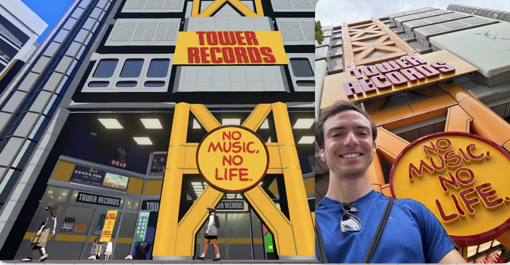

# Baldur's Gate 3

BG3 was a joy to play throughout the whole 180 hours Steam claims I have,
constantly surprising me in many different axis: with unexpected plot points
and twists, with interesting fail states, with dialogue choices that tempt the
player into save scumming just to see what kind of reaction they would trigger,
or with clever writing. One particular instance of this type of writing that
stuck with me is when Orin repeats "tomorrow, and tomorrow, and tomorrow...", a
reference to one of Macbeth's soliloquies; the game is full of those.

Act 3 is the best and biggest act, taking the player to the end of all plot
lines where big payoffs and high stakes choices are found, making me want to
play the game again just to experience more of those possibilities. It is a
super long game though, so I'm unsure when I'll get to do it.

This is definitely a "must play" game, for it shows how high the ceiling is for
the genre, and I expect it to be highly influential in the industry in the
years to come.

# Hades 2

This is just more Hades. The mechanics are improved, the scope of the game is
bigger, you control a new character, but it is fundamentally Hades. This is a
good thing; the first game was amazing and it's been long enough that I'm not
bothered by the lack of innovation. Small tweaks to the formula were enough to
make it feel fresh.

This time I had the chance to play it from day zero, so I got to see how the
game evolved (and still evolves) in Early Access. For example, they initially
overdid the amount of resources players must acquire to unlock features, some
fights were a bit too unforgiving, and one of the new mechanics (Lunar
blessings) feels underpowered / hard to justify building around. It's nice to
notice something that doesn't quite fit the game, think about it critically,
and then have the developers validate your opinion by tweaking the problematic
mechanics in the next patch.

Apparently there will be at least two more major patches before the full story
is available, so this is a game that will show up in my 2025 list again.

# Animal Well

A solid Metroidvania / puzzle / platformer game. It shines in how it introduces
its mechanics and map navigation, in how the mid-game puzzles can be solved in
vastly different orders, in how exploration-enhancing items can be mostly
skipped (or missed) and the game still makes sense, or in how its late game
puzzles are mind-blowing.

I heard Jason Schreier describe this as a 3-layer game. There is the basic
exploration you do through movement-enhancing items, which will take you to the
first ending. There is the egg collecting component, which will take you to the
"real ending". Finally, there's a set of super hard puzzles - likely requiring
google -, which will take you to... ? I don't know.

I almost stopped playing after the "first ending" but was convinced by a friend
to keep going, and it was totally worth it. This is one of those games where
"there's always another secret", and it still has stuff to show you after the
"real ending" if you have what it takes to 100% the game. I didn't, and some of
its mysteries still haunt me, but it was a fun journey and it deserves the hype
it got.

# Balatro

Pinning down what makes Balatro addicting is hard, but it is extremely
addicting, and it made my commute fly by. There isn't much to say here, other
than this is deck-building at its purest form, as opposed to something like
Inscryption where deck-building is mixed with storytelling and some escape room
elements. What I really appreciate about these games is how it keeps us engaged
with zero downtime: we go from decision to decision with at most two or three
seconds in between them, and the stakes (seewhatIdidhere) are always
increasing. Now that I say that, I think I've just solved the mystery that
started this paragraph.

# Pentiment

One of those games that had no right to be made in this economy, and it only
got greenlit because its director had a lot of credits with the decision making
people (see Noclip's documentary on the game). This is a historical
point-and-click game taking place in a 16th-century fictional city in Bavaria;
through a lot of reading and imagery, the game provides a lecture on local
culture, religion and politics. It definitely taught me a lot about a region
and period I didn't get to study much in school.

The non-fiction aspects of the game are why I say it had no right to be made:
it's just not something you can do marketing on, and it can be boring if you're
not on the right mindset to play. This is also what makes the game unique and
special, as it takes a lot of skill to turn this premise into a good game. I
suspect Obsidian pulled it off partially because they used a small team of
veterans, given them creative independence and the resources of a big studio.

# Thank Goodness You Are Here	

This is another point-and-click, but a very simple and short experience where
the focus is 100% on telling jokes at the expense of characters which are often
absurd caricatures (in the style of Monty Python). The world has some surreal
scenarios, making the player go "wtf?" in all the good ways. To complement the
tone of the game, incredible voice acting with thick northern British accents
and expressions.

# Brotato

This is just more Vampire Survivors, albeit you are a potato in this game. The
map is roughly the size of one screen, and this simple change provides
different challenges during gameplay, since enemies never "vanish" and you
can't get away of tough situations by just moving to a new part of the screen.
I think movement and dodging become way more important as a result. That said,
if introducing someone to the genre, I think Vampire Survivors is a better
package because it captures the "power fantasy" better, and it takes itself a
bit more seriously than Brotato does.

# Portal 2 (second playthrough)

I had first played this back in 2011 and playing it again made me realize that,
had this game been released in 2024, it would have reviewed equally well; in
other words, Portal 2 did not age. It is a game that accomplished everything it
set out to do, with writing, controls and puzzles that are on par with games
released 10 years later. I would argue this is a must-play game on the basis of
how well it does story-telling through narration, with Cave Johnson's rant
about lemonades being a treat everyone should experience.

# One Finger Death Punch (second playthrough)

A 2014 brawler where you play using two keys: one to hit right, and one to hit
left. It is essentially a "test your reflexes" game that can be quite addicting
and a great way to pass the time (shame there is no Mac port!). The sequel came
out in 2019, and I would have played it instead had I known about its release.

# Children of Morta

A roguelike combining the combat of Enter the Gungeon with the story-telling of
Hades. I played the 2-player co-op mode, and it was pretty solid overall. Each
character is very distinct and interesting to play, though some are more
vulnerable to lag than others (in my case, I was in the US-west and my friend
was in Brazil). The level variety is shockingly good and often surprises you
when the game breaks its normal level style. Sadly, I did not get to finish
this, as tends to be the case with a lot of co-op adventures; I probably would
have, had I played it solo.

# NEO: The World Ends With You	

This is the sequel to my absolute favourite DS game, which made use of a
dual-screen by allowing players to simultaneously control two characters, one
on each screen: one with the d-pad and one with the ABXY pad. The sequel,
adapting to modern platforms, had to do away with that, opting instead to have
players frequently switch between characters, an unfortunate but required
downgrade. The chaos of controlling two characters at the same time was one of
the defining elements of the original.

Revisiting the locations of the original was a real treat, and the new
locations in Shibuya fit the game seamlessly. This was extra special for me, as
I went to Japan for the first ever shortly after playing the game, and having
many digital Shibuya locations fresh in my mind made visiting the real place so
much better. I spent a whole day walking around that neighborhood while
listening to the OST -- both the original and the sequel are great -- and could
not shake the smile off my face, as I would predict what I was about to see at
every turn.

{style="display:block; margin: auto;"}

The game also evolved the original's method of storytelling. Whereas before
you'd have characters and speech bubbles, NEO used manga frames being drawn as
the dialogue took place, which was visually pleasing and engaging. The story
contained some questionable choices: it was _too_ over the top at times,
dabbled in time travel, and tried to appeal to nostalgia often. That said, I
think this is still a must play for fans of the original.

# Ghosts of Tsushima	

This one was tough. As much as I wanted to like it, this game suffered from the
God of War aftereffect, offering an inferior experience in all ways possible:
combat, storytelling, questing, equipment upgrading, writing. They were all
good but, at the same time, it was impossible to shake the feeling of "I've
seen this done better in a different game". I understand why people liked this
game, but cannot understand all the praise it got given how this game came out
in 2020, two years after the God of War reboot.

I did finish the game, and it was a satisfying experience, with one notable
exception. The open world, while huge and varied in scenery, offers repetitive
exploration goals. Legendary quests excepted, the world only contains a handful
of different activities stamped out multiple times throughout a massive map
that is unlocked over the course of three acts. Once I noticed the repetition,
and that it was there mostly to inflate the playtime, I stopped doing those
activities and just rushed the main quest; this seems like the best way to
enjoy this game (again, compare to how God of War did world exploration). I
hope this gets addressed in Ghosts of Yotei.

# Sea of Stars

A fresh take on the JRPG genre and a lesson in how to handling the dangers of
random encounters and turn-based RPG combat. No element of this game ever
overstayed its welcome, each city / map was just big enough, the
world-exploration-before-final-boss segment was also just the right size and
the battles never felt unwelcome.

The story was also well told, providing two different endings that build on top
of each other in a satisfying way, with some really cool lines to play with
your feelings (looking at you, "borrowed time"...). You don't have to play the
game twice: it is enough to experience the first ending, reload, and do the
100% completion required for the second ending, a requirement easily achievable
with about three hours of extra gameplay.

The soundtrack is also amazing, you know you're in for a treat as early as the
main menu.

# Did not Finish 

I tried playing Sekiro, twice. I love games where I can throw myself at a super
hard boss over and over again. Sekiro has that in spades, but sadly the
"fail-retry" loop takes forever, and the game forces you to go over the same
thrash mobs every single time, a pattern common to all FromSoftware games.
While I see some (weak, IMO) arguments for this design choice, it made me put
the game down. I'm still waiting for a mod that transforms this game into a
boss rush type of thing.

Also played Hi-Fi RUSH and Noita. Nothing really prevented me from finishing
them, other than that they didn't grab my attention as strongly as others.
