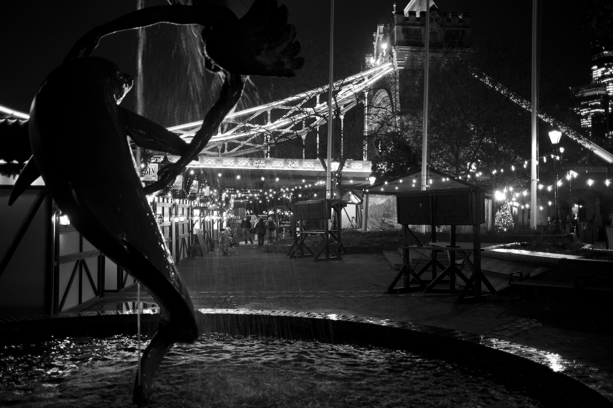
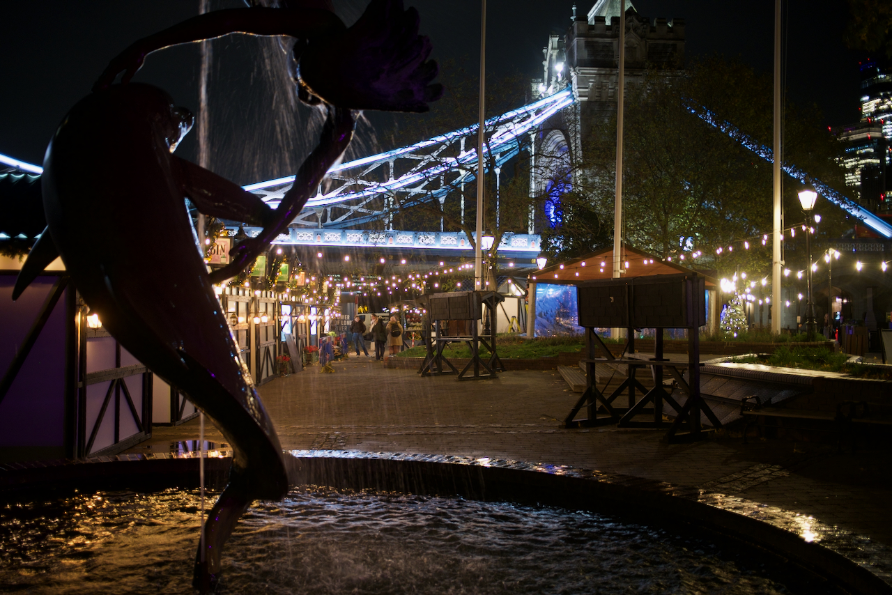
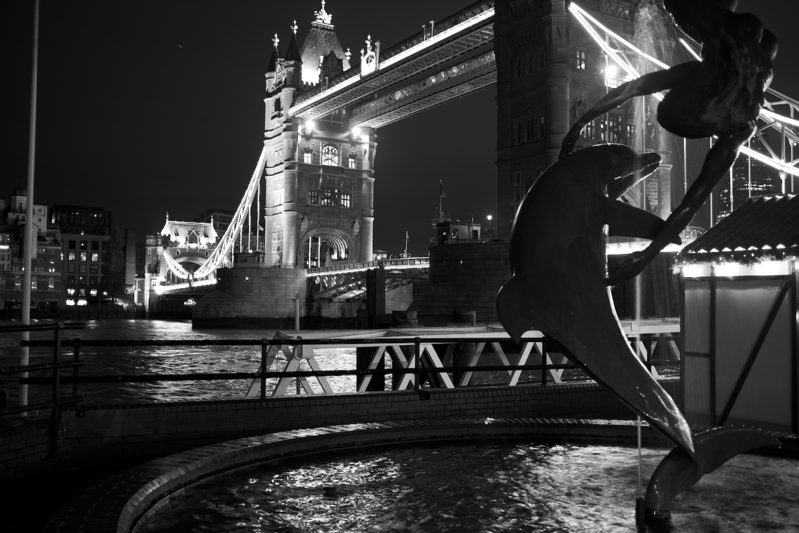
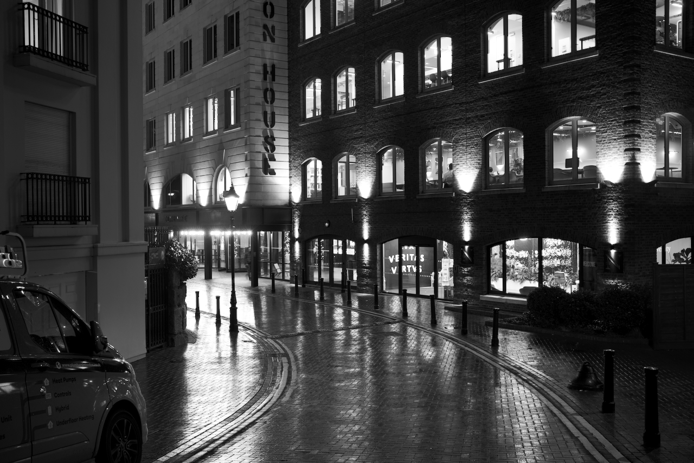

After getting a nudge from a friend, I decided to give black and white
photography a try, having no real idea about what I had to do other than using
the B&W film simulation setting on the X100VI; even that would prove to be
misleading, as I would soon learn that, while shooting raw, the film simulation
only applies to the electronic viewfinder and to the photo's thumbnail embedded
in the file. You're supposed to do B&W in post, which is what I did for the
photos shown here.

Out I went on a cloudy London night around 20:00, towards St Catherine's docks.
With the idea of having Tower Bridge on the background, I soon found a
yet-to-open Christmas market that provided a nice mood for the photos.

{style="display:block; margin: auto;"}

The first thing I noticed is that B&W can make some shots _more_ attractive by
highlighting details of the setting that would have otherwise been shadowed by
colors elsewhere. In this shot, my eyes immediately focus on the shape of the
sculpture in the fountain, in the water falling, then in the array of closed
shops on the left, and on the family at the very back. The sheer number of
Christmas lights become evident and, ironically, the massive bridge is one of
the last things I look at there. The same photo in colour, no post-processing:

{style="display:block; margin: auto;"}

The blue of the bridge dominates the picture a lot more, doesn't match well the
yellow lights and, in colour, the ISO artifacts become quite evident (easier to
spot in the sky). This was one of the first photos I took, so the settings (ISO
800, 1/34s, f/2) were automatically chosen by the camera, which tends to favour
higher ISO values in dark environments. From here on, I set ISO to 250 and
forced a shutter speed of 1/4s; as a result, the noise is gone in this next
shot:

{style="display:block; margin: auto;"}

Compare the sky in this picture with the sky in the previous one, it is much
cleaner now. Still, the colors don't form a cohesive whole from this angle. If
we take them away...

{style="display:block; margin: auto;"}

Suddenly, things fit together much better. Here's another shot of just the
bridge:

{style="display:block; margin: auto;"}

I finished the evening walk with some shots of empty streets, where B&W is
helpful at highlighting light sources while also somehow emphasizing the
emptiness outside:

{style="display:block; margin: auto;"}

{style="display:block; margin: auto;"}

{style="display:block; margin: auto;"}
