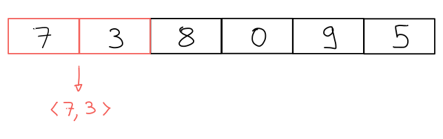
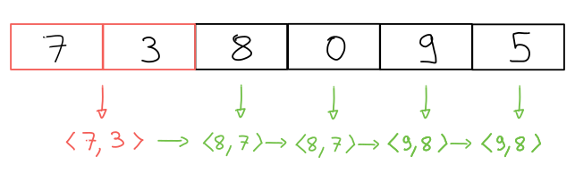
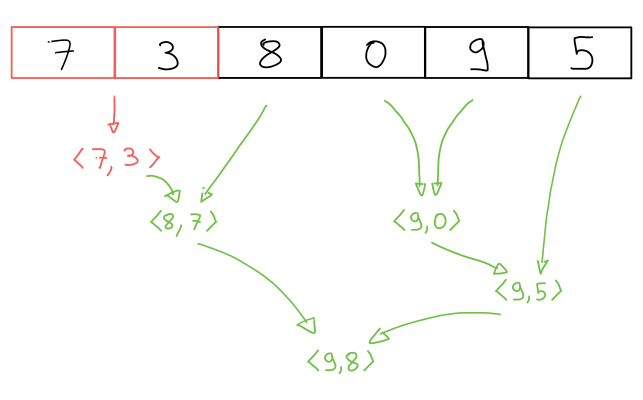

This is inspired by the [ADSP: The Podcast], in particular "Episode 72: C++
Algorithm Family Feud!".


# Problem Description

Given a vector of integers of length at least two, find two largest elements in
the vector:

```cpp
pair<int, int> max2(const vector<int> &input);
```

Our goal is to solve this problem using [algorithms shipped in the C++ standard
library].

The podcast hosts debate whether we can return repeated elements when the input
has repeated elements. As the problem is stated _here_, we can: two largest
elements in a vector are two elements that are `>=` all other elements.

# Algorithm: Sort

We can sort the input  and return its first two elements:

```cpp
pair<int, int> max2(const vector<int> &input) {
  auto sorted = input;
  ranges::sort(sorted, std::ranges::greater());
  return {sorted[0], sorted[1]};
}
```

This solution has two downsides:

1. We need to copy the input, or mutate the original.
2. It is not optimal in complexity: this is an `O(N logN)` solution, where `N`
is the size of the input. It is possible to solve this with a linear solution.

# Algorithm: Partial Sort

Sorting produces more information than we need, that is, it sorts the entire
input when we are only interested in the first two elements of the sorted
input. Partial sorting does exactly what we need: it produces the first X
elements in the sorted array.

```cpp
pair<int, int> max2(const vector<int> &input) {
  auto sorted = input;
  ranges::partial_sort(sorted, sorted.begin() + 2,
                       ranges::greater());
  return {sorted[0], sorted[1]};
}
```

The complexity of this algorithm is `O(N log M)`, where `N` is the size of the
input, and `M` is the number of sorted elements we requested, in this case `M =
2`. So the complexity is now linear: `O(N)`'.

However, we still have the downside of mutating / copying the input.

# Algorithm: N-th Element

The `nth_element` algorithm can be used to find the `n-th` largest element in
the input. Calling it twice, once with `n = 0` and once with `n = 1` should
produce the desired answer. I'll skip this solution.

# Algorithm: Accumulate / Left Fold

The accumulate algorithm takes an input value and "combines" it with the other
elements in a collection, one at a time. The analogy with left folding is that
we think of accumulating as folding the collection, left to right, one element
at a time.

In our case, we start with a pair of integers containing the first two elements
of the vector:

{style="display:block; margin: auto;"}

Then we combine this pair with the other input elements by
replacing the smaller components of the pair:

{style="display:block; margin: auto;"}

The code looks like this:

```cpp
pair<int, int> max2(const vector<int> &input) {
    auto accumulate_function =
        [] (pair<int, int> current_max, int next_value)
        -> pair<int, int> {
            if (next_value >= current_max.first)
                return {next_value, current_max.first};
            if (next_value >= current_max.second)
                return {current_max.first, next_value};
            return current_max;
        };
    auto initial_value = make_pair(input[0], input[1]);
    return accumulate(input.begin() + 2, input.end(),
                      initial_value, accumulate_function);
}
```

This solution neither modifies the input, nor makes copies of the input. It is
also linear in complexity.

# Algorithm: Reduce

[Cppreference] describes `std::reduce` as:

> similar to `std::accumulate`, except out of order

Like `std::accumulate`, `std::reduce` combines elements of the input in order
to produce the final result, but this is done in an unspecified order.

Let's consider our previous example:

{style="display:block; margin: auto;"}

We again initialize our answer to the first two elements of `input`. _One_
possible way to combine combine the rest of the elements is:

{style="display:block; margin: auto;"}

Because these are done in an unspecified order, our accumulate function needs
to handle a few different inputs:

1. Two `int`s. See how `0` and `9` were combined.
2. A `pair` and an `int`. See how `<7, 3>` and `8` were combined.
2. An `int` and a `pair` (not shown above).
3. Two pairs. See how `<8, 7>` and `<9, 5>` were combined.

In other words, the accumulate function needs to work with different input types.

If we also want _deterministic_ output, the accumulate function needs to be
associative and commutative. This is not relevant to us but could be, for
example, when doing arithmetic on floating point numbers.

One way to implement four different versions of the accumulate function is with
operator overloading:

```cpp
struct Reducer {
  pair<int, int> operator()(int a, int b) {
      return {std::max(a, b), std::min(a, b)};
  }
  pair<int, int> operator()(pair<int, int> current_max,
                            int next_value) {
    // See `accumulate` lambda in the Accumulate solution.
  }
  pair<int, int> operator()(int next_value,
                            pair<int, int> current_max) {
      return (*this)(current_max, next_value);
  }
  pair<int, int> operator()(pair<int, int> pair1,
                            pair<int, int> pair2);
};
```

The first overload (`int`, `int`) is trivial: we just make a pair.

The second overload (`pair<int, int>`, `int`) is just the accumulate lambda
we used in the `std::accumulate` solution.

The third overload (`int`, `pair<int, int>`) is identical to the second one,
with the arguments swapped.

The fourth overload is equivalent to solving a simple version of the problem:
find the largest two elements out of four. This is tedious to implement, it is
safer to call one of our previous solutions and let the compiler optimize it:

```cpp
pair<int, int> operator()(pair<int, int> pair1,
                          pair<int, int> pair2) {
   auto arr = std::to_array({pair1.first, pair1.second,
                             pair2.first, pair2.second});
   return max2_array(arr);
}
```

I'm assuming that `max2_array` is an implementation of the `accumulate`
solution that works with an `std::array<4, int>` instead of a `vector`. This
should ensure the optimizer does its job well. If you can read LLVM IR, or are
familiar with a RISC-like assembly, [here's the proof]. Note how there are no
loops, no branches, and the code is fairly short. Try changing `std::array` to
`std::vector` and see how different the code becomes.

# Algorithm: Transform-Reduce

The reason the previous solution requires four overloads is that we are mixing
two different types: `pair<int, int>` and `int`. What if we transformed our
input from `int` to `pair<int, int>` before doing the reduction?

This is exactly what `transform_reduce` does: it applies a transformation to
each element of the input before performing the reduction.

This idea can be implemented as follows:

```cpp
pair<int, int> max2(const vector<int> &input) {
    auto transform = [](int a) {
        return make_pair(a, numeric_limits<int>::min());
    };
    auto reduce = [](pair<int, int> pair1,
                     pair<int, int> pair2) {
        auto arr = to_array({pair1.first, pair1.second,
                             pair2.first, pair2.second});
        return max2_accumulating(arr);
    };

    auto initial_value = make_pair(input[0], input[1]);
    return transform_reduce(input.begin() + 2, input.end(),
                            initial_value,
                            reduce, transform);
}
```

# Conclusion

The experiment of using different algorithms to solve the same problem always
teaches me something new; for example, I had no idea that
`std::transform_reduce` existed. Similarly, having the compiler solve the
four-element instance of the problem is something that I only considered
because I sat down and thought about the problem.

I hope you learned something too, or that it helps you with your next NVIDIA
interview ;) Definitely checkout the [ADSP podcast]!

[ADSP: The Podcast]: https://adspthepodcast.com/2022/04/08/Episode-72.html
[ADSP podcast]: https://adspthepodcast.com
[algorithms shipped in the C++ standard library]: https://en.cppreference.com/w/cpp/algorithm
[Cppreference]: https://en.cppreference.com/w/cpp/algorithm#Numeric_operations
[here's the proof]: https://godbolt.org/z/h5jPbMhKE
