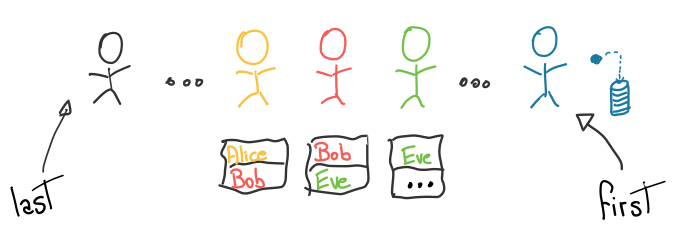
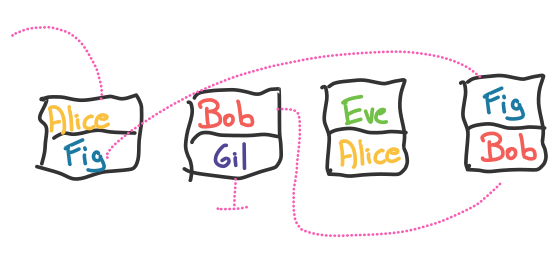
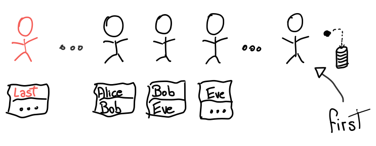

The original problem can be found on the book The Art of Computer Programming
(TAOCP), Volume 3, Second Edition, Section 5, Exercise 24. The book is famous
for many reasons, one of which being that it provides a lot of interesting
exercises; this one has a very simple description and yet it lends itself to
a nice discussion.

# Problem Description

A few billion people formed a line. They all received a piece of paper, and in
it they wrote:

* Their name,
* Followed by the name of the person in front of them.

All names are unique.

The first person threw away their piece of paper without writing anything. The
other pieces of paper were collected, _shuffled_, and given to you in the form of
a "vector of pieces of paper".

{style="display:block; margin: auto;"}

Your goal is to reconstruct the original line by _printing_ the names of each
person, from _last to first_.

# Programming Interface

For the purposes of this discussion, let's use this C++ interface:

```{.cpp .numberLines}
struct Paper {
  Name author;
  Name in_front;
};

void reconstruct(vector<Paper> &entries) {
  // Print the names in the original order.
}
```

Assume `Name` is some data type that can be compared with `<`.

# One Solution

Here's where you stop to think about the problem :)

Common solutions involve creating auxiliary data structures like sets or
dictionaries; let's explore how to do it without using extra memory.

## Reconstructing Part of the Line

We can choose an arbitrary `Name some_name` and reconstruct the line in front
of that person:

1. Search `entries` for the paper with `some_name` as its author,
2. Print its `in_front`,
3. Repeat with `some_name = in_front`.

When the search in Step 1 fails, we've found a name who is not the author of
any piece of paper: that's the first person in the line, so we're done.

For example, suppose we were given this input and want to reconstruct the line
in front of Alice:

{style="display:block; margin: auto;"}

We look for Alice's paper, then Fig's, then Bob's, then Gil's and that's when
we fail.

Each search (dotted line) can potentially scan the entire input, leading to
linear complexity on each search. By sorting the papers according to their
author, we can binary search instead, making each search logarithmic in
complexity.

This idea can be implemented in C++ as follows:

```{.cpp .numberLines}
void reconstruct_from(const Name &some_name, vector<Paper> &entries) {
  auto get_author = &Paper::author;

  ranges::sort(entries, std::less(), get_author);

  auto next_entry = [&](const Name& name) {
    return ranges::lower_bound(entries, name,
                               std::less(), get_author);
  };

  for (auto it = next_entry(some_name);
            it != entries.end();
            it = next_entry(it->in_front))
    std::cout << it->in_front << "\n";
}
```

If we have `N` pieces of paper, the complexity of this algorithm is `O(N*logN)`:

* The sorting step itself is `O(N*logN)`
* The loop has at most `N` iterations, each of which performing a `O(logN)`
search.

## Identifying the Last Person

We've shown how to print the line starting at an arbitrary person; if we call
`reconstruct_from` with the last person as input, we're done. But how do we
identify the last person in line? Let's look at the line again:

{style="display:block; margin: auto;"}

The last person:

1. Is the `author` of *some* piece of paper.
2. Is *not* the `in_front` of any piece paper.

These properties suggest the following algorithm: for each `author`, search for
that name in the `in_front` entries. If the search fails, that's the last
person in line. To make the searching step efficient, we sort the entries
according to the `in_front` field.

This idea can be implemented in C++ as follows:

```{.cpp .numberLines}
Name find_last_person(vector<Paper> &entries) {
  auto get_in_front = &Paper::in_front;
  ranges::sort(entries, std::less(), get_in_front);

  auto is_last_person = [&](const Name &name) {
    return !ranges::binary_search(entries, name,
                                  std::less(), get_in_front);
  };

  auto get_author = &Paper::author;
  auto it = ranges::find_if(entries, is_last_person,
                            get_author);
  return it->author;
}
```

If we have `N` pieces of paper, the complexity of this algorithm is `O(N*logN)`:

* The sorting step itself is `O(N*logN)`
* The `find_if` call performs at most `N` calls to `is_last_person`, which is
itself a `O(logN)` search.

## Putting It All Together

All that's left to do is to combine the two main routines into a final solution:

```{.cpp .numberLines}
void reconstruct(vector<Paper> &entries) {
  auto last = find_last_person(entries);
  std::cout << last << "\n";
  reconstruct_from(last, entries);
}
```

You can find the [full solution here].

## Mutability Gotcha

The implementation above mutates the input vector by sorting in-place in order
to avoid unnecessary data copies. However, this requires extra care when using
references to elements of the vector.

For example, let's change the signature of `find_last_person` to return a
reference inside `entries`:

```{.cpp .numberLines}
const Name& find_last_person(vector<Paper> &entries);
```

And let's change `reconstruct` to store this reference:

```{.cpp .numberLines}
void reconstruct(vector<Paper> &entries) {
  const auto &last = find_last_person(entries); // Reference!!
  reconstruct_from(last, entries);
}
```

This is going to fail for a subtle reason: `reconstruct_from` will sort
`entries`, and this will change what `last` points to. You can experiment with
this [faulty program].


## More Efficient Representations for Name

If we choose a specific data type for `Name`, can we use better algorithms?

When looking for the last person in line, we're trying to find the only name
that does not appear in a list of names. If names are the `N` integers from `0` to
`N-1`, we can use the "XOR trick" to find the missing number.

Consider the following properties of XOR (`⊕`):

* `a ⊕ a = 0`, for all numbers `a`.
* `0 ⊕ a = a`, for all numbers `a`.
* `a ⊕ b = b ⊕ a`, for all numbers `a, b` (commutative).

Let's XOR all the `N` numbers from `0` to `N-1` with all the `N-1` `in_front`
entries:

$$(0 ⊕ in\_front_0) ⊕ (1 ⊕ in\_front_1) ⊕ ... ⊕ (n-2 ⊕ in\_front_{n-2}) ⊕ n-1$$

Every number in the range from `0` to `N-1` appears twice, with the exception
of the missing number. Because XOR is commutative, the expression above is
equivalent to:

$$(a ⊕ a) ⊕ (b ⊕ b) ⊕ ... ⊕ (z ⊕ z) ⊕ missing\_number$$

Since the XOR of a number with itself is zero, the whole expression is equal to
`missing_number`.

This idea can be implemented in C++ as follows:

```{.cpp .numberLines}
Name find_last_person(vector<Paper> &entries) {
  auto get_in_front = [](const Paper &p)
                      { return p.in_front; };
  auto in_fronts = entries |
                   std::views::transform(get_in_front);
  auto xor_in_fronts = std::accumulate(
      std::begin(in_fronts), std::end(in_fronts),
      0, std::bit_xor());

  auto indices = std::ranges::iota_view{
                 0,
                 1 + static_cast<int>(entries.size())};
  auto last_person = std::accumulate(
      std::begin(indices), std::end(indices),
      xor_in_fronts, std::bit_xor());

  return last_person
}
```

(Unfortunately, `std::accumulate` does not yet have support for ranges)

Have a look at the [complete solution].

This algorithm is linear in the length of `entries`. The complexity of
`reconstruct_from` remains the same.

# The Donald Knuth Solution

What we discussed here is NOT the intended solution to the original problem.
The book adds a few extra constraints to the problem: it states that the input
is in a tape, i.e., storage without random access but available in great
amounts. It also states we have some _limited_ amount of random access memory, a
fancy way of saying that we are allowed to sort the input as needed.

The reference solution is complex, juggling five lists at the same time. It
starts like this: create a list with the `author`s and a list with the
`in_front`s, and sort both lists. With those, we can find the first and last
person in line by [zipping] over both lists. The pairs produced by the zip
should contain identical names, except when one of them is the first or last
person in line. When this happens, how do we know whether we found the first or
last person?

I will leave you with that question. Even this only scratches the surface of
the full solution.

[faulty program]: https://godbolt.org/z/f1oPjh4W5
[full solution here]: https://godbolt.org/z/E7rj8fPK3
[complete solution]: https://godbolt.org/z/PqPY9h5xb
[zipping]: https://en.wikipedia.org/wiki/Zipping_(computer_science)
