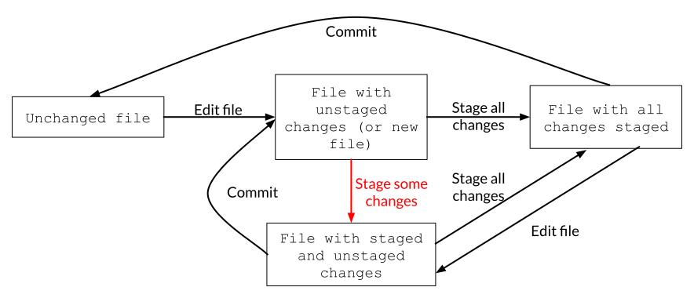
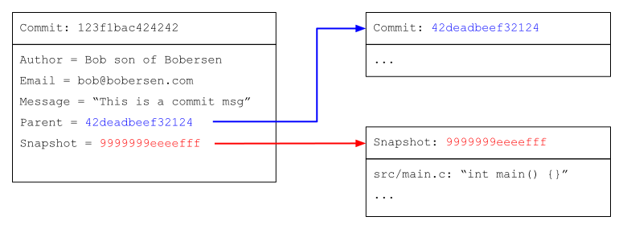
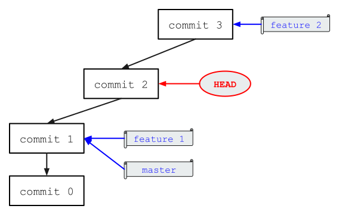
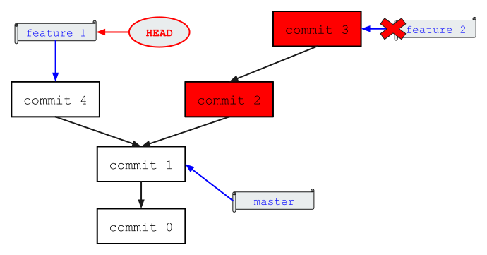
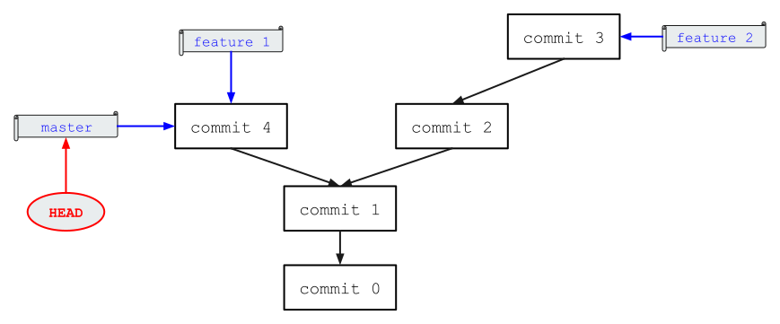
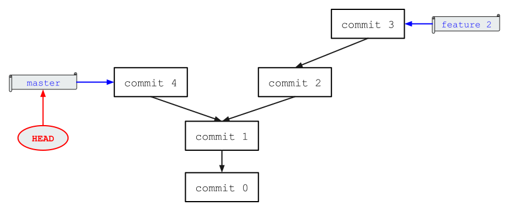
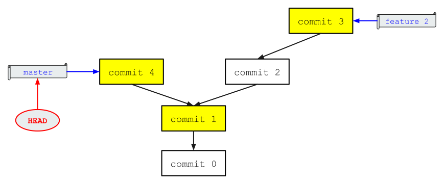
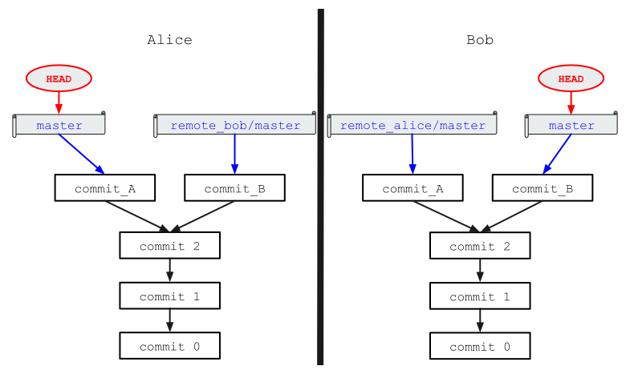

Git is an ubiquitous tool in software engineering, but it is difficult to find
an introduction to its mental model; Git users often repeat a set of memorized
commands that work for most situations, resorting to colleagues when the cheat
sheet fails.
By understanding Git's conceptual model, one is able to use the tool with
independence, to employ it in new ways, and to solve problems faster; such
payoff is possible because, with the mental model in mind, one can frame git
problems as an operation on the commit history graph. More importantly, this
becomes a habit.

In this post, we'll go over Git's conceptual model *without mentioning a single
command-line operation*. Once the model is clear, we look at daily actions
performed by developers and map those actions to Git concepts.

# Saving Snapshots of the Project

A version control system is a program that keeps track of the state of a
repository as it evolves through time, allowing us to go back and forth
between states, to record new states, and to inspect the history of the
repository. In Git, saving a new state of the repository consists of:

1. Making changes to files or adding new files.
2. Specifying which changes should be recorded by adding those changes to the
*staging area*.
3. Performing a *commit* operation.

## Staging

The staging area consists of a set of changes that will be included by the next
commit operation, partitioning the files of a repository into three categories:

{style="display:block; margin: auto;"}

By editing files, staging *changes*, and doing a commit operation, files move
between those categories:

{style="display:block; margin: auto;"}

By editing a file, staging the all changes, and editing the file again, we
create a new kind of file that has both staged and unstaged changes. Since
commits only record staged changes, creating a commit at this point will still
leave that file with uncommitted changes:

{style="display:block; margin: auto;"}

Git also allows us to stage *some* of the changes in a file, which is helpful
in case they don't all logically belong on the same commit.

{style="display:block; margin: auto;"}

## Commit Definition

So what is a commit operation? It is the act of taking *a snapshot of the
entire repository* and storing it into an internal data structure. A
commit operation creates a commit object, which consists of:

1. A pointer to that snapshot.
2. The author's name and email.
3. A commit message.
4. A hash of the commit object that came directly before this commit.
5. Other metadata.

We refer to a commit object by hashing its contents and using the resulting
hash string.

{style="display:block; margin: auto;"}

Unfortunately, the verb "commit"  and the noun "commit" are the spelled the
same way in English; when we use it as a verb, we mean the act of performing a
commit operation, whereas the noun refers to the commit object (or its hash).

## Commits Form a Graph

Because a commit stores a reference to the preceding commit, the repository can
be represented as a directed acyclic graph: nodes are commits and a directed
edge `(commit2, commit1)` indicates that commit `commit1` is a parent of
`commit2`.

{style="display:block; margin: auto;"}

For ease of representation, the picture uses names for the commits, but
`commit1` and `commit2` should be the hash of the respective commit objects.

## Branches: a Name and a Hash

The concept of a *branch* is what allows us to navigate through important states
of a repository. A branch in Git is a pair `(name, commit hash)`.

{style="display:block; margin: auto;"}

In this example, we have two branches named `feature1` and `master`, both
pointing to commit `commit1`, and a branch named `feature2` pointing to
`commit2`.

Note: there is nothing special about the branch named `master`. When we create
a repository from scratch, we need a name for the starting branch; `master` is
the default provided by git.

## You Are Where Your `HEAD` Is.

During development, we will be frequently checking out the state of the
repository at different points in time. How do we know which snapshot we're
looking at? This information is tracked by a special pointer called `HEAD`.
Most of the time, `HEAD` points to a branch:

{style="display:block; margin: auto;"}

In this example, `HEAD` points to `feature2`, so we are looking at the
repository as defined by branch `feature2`, which points to `commit2`. When we
add a new commit, we advance the branch pointed to by `HEAD`:

{style="display:block; margin: auto;"}

## Detached `HEADS`

What if we want to inspect snapshots that are not pointed to by any
branch, like `commit2`? We can use its hash, forcing `HEAD` to point to it:

{style="display:block; margin: auto;"}

The repository is now in a *detached  `HEAD` state*, that is, `HEAD` is not
following any branches; while this is useful to inspect the repository in
arbitrary points in time, it is not a state in which we would work on, since we
want changes to be tracked by branch names for ease of access. Once in a
detached `HEAD` state, we'll either create a new branch pointing to the current
snapshot, or switch to some other branch; both of those actions restore `HEAD`
to its natural state: that of tracking branches.

## Change Branches Often...

Changing a branch is simple: just point `HEAD` to it, and Git will assemble the
repository as it was in the commit pointed to by that branch.

{style="display:block; margin: auto;"}

## ... Except When You Can't

Changing branches is a natural operation that we perform often, but it has the
potential to overwrite non-committed changes.

For example, suppose we have edited `main.cpp` **but not committed those
changes** and suppose we attempt to change `HEAD` to `other_branch`.  However,
`main.cpp` is different in `other_branch`. What should happen to our
non-committed changes? Should Git discard them and overwrite `main.cpp` with
the version in `other_branch`?

Git follows the principle to **never** allow changes to be lost by accident,
unless we are explicit about it by using keywords like "force" or "hard" in the
command line interface.

In the example above, unless Git can *cleanly* and *unambiguously* apply the
non-committed changes on top of the target branch, it will _not_ let us change
branches. More precisely, we should be able to move back and forth between two
branches without any loss of information; if that's not possible, Git will not
let us change branches.

Merely staging the changes wouldn't be enough either. In other words: commit,
commit, commit, commit. Don't be afraid of committing, it is the most powerful
tool in our toolbox.

## The Graph Doesn't Have to Be Linear

So far, our graph has always been a "straight line":

{style="display:block; margin: auto;"}

However, what happens if we add a new commit to `feature1`? The graph becomes
more interesting:

{style="display:block; margin: auto;"}

Because `HEAD` was pointing to the `feature1` branch, the next commit advanced
that branch. The commit graph is no longer linear!

## Deleting a Branch Deletes a Name

Because a branch is just a pointer, deleting it is a quick operation: just
delete the pointer. However...

### Git Will Not Let You Delete Some Branches

What if deleting a branch would cause loss of information?

The canonical way to navigate between states of the repository is by
changing `HEAD` so that it points to different branches, and that is done
through branch names; Git doesn't expect us to memorize hashes.

Consider this example:

{style="display:block; margin: auto;"}

By deleting branch `feature2`, the commits in red would be lost forever: there
is no branch that includes those commits, i.e. there is no way to put the
repository in a state containing those commits[^1]. The only way to inspect
those commits would be if we memorized their hashes and moved into a detached
`HEAD` state. As such, Git will not let us delete that branch unless we force
it to.

[^1]: In fact, Git would permanently delete all contents associated with those
commits next time it tries to cleanup its internal data structures.

# Merging Branches

We've seen what branches are and how they relate to commits, but how do we
merge work from one branch into another? There are different ways to accomplish
this, and the choice depends on what we want the final commit history (i.e. the
graph) to look like.

## Easy Merging: Fast-Forward

Consider the scenario from before:

{style="display:block; margin: auto;"}

Suppose the work from the `feature1` branch is ready to be merged back into
`master`. To emphasize: we want to merge `feature1` into `master`, not the
other way around (more on this later).

Well, lucky us, nobody has committed into master since the work on `feature1`
started! Because **all commits in `master` are also in `feature1`**, Git can
simply move the `master` pointer *forward*, a method known as a *fast forward*:

{style="display:block; margin: auto;"}

This method is always free of conflicts, that is, it will never require manual
intervention to resolve issues arising from edits made in the same file on the
two branches being merged.

The `feature1` branch is now irrelevant and can be deleted:

{style="display:block; margin: auto;"}

## Non-Trivial Merges

With many developers working on the same repository, fast-forwards are
infrequent. Suppose the `feature2` branch from above is ready to be merged back
into master, what will happen?

### Three-Way Merge

When fast forwards are not possible, Git identifies three commits to help it
perform the merge:

1. The commit pointed to by the destination branch.
2. The commit pointed to by the source branch.
3. The commit that is the lowest common ancestor of 1 and 2.

In the previous example, the commits are as follows:

{style="display:block; margin: auto;"}

Using those commits, Git will merge the two branches, identify conflicting
changes and create a new commit representing the merge:

{style="display:block; margin: auto;"}

If any conflicting changes are found, Git will ask us to resolve them before
the merge commit is created.

The `feature2` branch can now be deleted.

The final commit graph accurately reflects the real history of the repository:
`commit 4` and `(commit 2, commit 3)` were developed in parallel, and later
merged together. This is expressed by the absence of any ordering between those
two sets of commits in the graph.

### Rebasing

While three-way merges preserve the development history accurately, the commit
graph gets complicated quickly in big projects; as a result, some projects
forbid three-way merges. To maintain a linear history, a different merge
procedure is needed.

Let's pretend we never did the three-way merge with `feature2`:

{style="display:block; margin: auto;"}

Instead of a three-way merge, we can re-apply commits from `feature2` on top of
`master`; this is known as a *rebase* of `feature2` on top of `master`.

1. Start with `HEAD` on the source branch (`feature2`).
2. Git rewinds `HEAD` to the lowest common ancestor of the two branches.
3. Git forwards `HEAD` along the path of the target branch (`master`).

    {style="display:block; margin: auto;"}

4. Git replays the commits of `feature2`.

    {style="display:block; margin: auto;"}

If any commits can't be applied cleanly, Git asks for our intervention before
continuing. This is done _for each_ commit being rebased; the developer
is forced to fix commits so that they can be applied cleanly, one at a time, as
if those commits had originally been developed on top of the destination
branch.

The rebased commits are different from the original ones and they will have
different hashes. Why? The rebased commits have different parent commits, and
this is enough to change their hashes; if we also fixed conflicts during the
rebase, the commit contents will be different and also affect the hash.

Now if we switch `HEAD` to `master` and try to merge it with `feature2`, a fast
forward will do! The repository history is kept linear.

### Keeping Feature Branches Up-To-Date With the Main Branch

When developing a big feature on a separate branch, it's wise to ensure our
code is up-to-date with the main branch of the project, otherwise we run the
risk of working on top of a stale version of the code base. One way to stay
up-to-date is by frequently merging the main branch into the feature branch:

{style="display:block; margin: auto;"}

That picture shows how complicated commit graphs can get in this scenario. In
projects disallowing three-way merges, we would frequently rebase the feature
branch on top of the main branch:

{style="display:block; margin: auto;"}

This keeps the history linear at the cost of more work for the developer, since
they will have to solve potential conflicts that arise.

# Distributed Git

So far, everything we've covered assumes that the entirety of development is
performed locally, that is, there are no copies of the repository outside our
machine. There are no pesky coworkers, no remote servers, nothing!

However, that's not how modern development is done. So how does Git enable
developer collaboration?

## Remotes

A *remote* is just another copy of the same repository located elsewhere.
Git needs to know where and how to find it through an address and protocol:
ssh, https, file system path, etc.

Suppose Alice and Bob both have a copy of the repository in their own machines,
and the machines are connected on some network:

{style="display:block; margin: auto;"}

Supposing Alice and Bob want to collaborate, they need the ability to see what
each other is up to, which is where the concept of git *remotes* are useful.
Alice adds a *remote* called `remote_bob` and Bob adds a *remote* called
`remote_alice`, resulting in the following repositories:

{style="display:block; margin: auto;"}

If both *fetch* updates from their remotes, they will obtain the following
trees:

{style="display:block; margin: auto;"}

## Agreement on Distributed Systems Is a Hard Problem

Because the copies are independent of each other, branches may evolve differently
in each remote. For instance, Alice and Bob might make different, independent commits
in their master branches:

{style="display:block; margin: auto;"}

They no longer agree on what the master branch should be, and the situation can
get worse if there are many developers working at the same time. How are all
these developers supposed to agree on what the correct version of a branch
should be?

## Follow an Origin

The typical way to solve this problem is by electing a *remote* to be the
correct copy of the repository, and letting developers try to influence it on a
first-come first-serve basis. Usually, this remote is called `origin` and it
lives on some website (like GitHub).

Consider the situation we had before, where Alice and Bob had diverged on what
master should look like. Instead of interacting with each other's repository
directly, they only interact with `origin`:

{style="display:block; margin: auto;"}

(I'm omitting `HEAD` here to keep the diagram manageable.)

To publish their own versions of `master` to `origin/master`, Alice and Bob will
attempt to perform a *push* operation into their `origin` remote. Let's assume
that Alice performs her *push* first, resulting in the following scenario:

{style="display:block; margin: auto;"}

Notice how Bob doesn't yet know that `origin` has accepted Alice's update to
master. When Bob tries to push his `master` into `origin/master`, Git will tell
him: "I can't do this, because your `origin/master` is not what `origin` says
it should be. Do a *fetch* first!"

Once Bob fetches `origin`, this is what he sees:

{style="display:block; margin: auto;"}

Then Bob can either rebase `master` on top of `origin/master` or merge
`origin/master` into `master`. Now Bob is ready to *push* `master` to
`origin/master`.

Here's what the final result would look like if Bob had used the merge option:

{style="display:block; margin: auto;"}

## Origin With Some Interface

In the previous example, `origin` could only be changed by trying to `push`
updates to it. However, all pushes are rejected unless we have
the exactly same view of the branch being pushed to as `origin` does.

To fix this problem, it might be desirable to have `origin` itself run commands
on its copy of the repository and let downstream users -- like Alice and Bob --
get updates by fetching; this is what services that host a repository typically
provide.

For instance, Alice might create a new branch, do some work, commit, and push
this new branch to `origin`. This push will always work without issues, because
she's the only one working on it (barring any unlucky events where Bob created
a branch with the same name)

{style="display:block; margin: auto;"}

Alice can then go into the interface provided by `origin` - likely a webpage -
click a "create merge request" button, specifying `feature_alice` as the source
branch and `master` as the destination branch.  This will have the effect
of `origin` performing the merge on its side.

{style="display:block; margin: auto;"}

Note that Alice will not see the merge on her copy of the repository until she
performs a fetch.

If the merge can't be performed due to conflicts, the interface will let Alice
know.

# Conclusion

With the mental model clear, we'll have a much easier time with the command
line interface, as the terminology used in this article reflects what Git uses
for its commands and its manual. The next step is to start over, and match
each operation we discussed to its equivalent command. I've linked some
resources for further reading below.

# Further Reading

* Git has its own book called [Pro Git] and it's free! It is by far the best
resource I found while learning.

* If you're wondering how to use branches to effectively manage a project, I
recommend reading the following articles: [A successful Git branching model]
and the [Github guide].

[Pro Git]: https://git-scm.com/book/en/v2
[A successful Git branching model]: https://nvie.com/posts/a-successful-git-branching-model/
[Github guide]: https://guides.github.com/introduction/flow/
