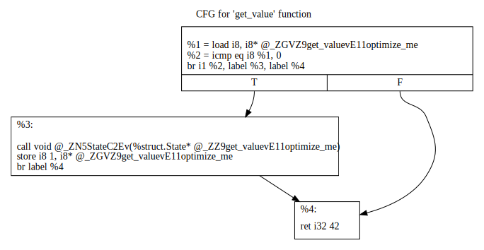

In a recent discussion over Twitter, it was pointed out that optimizers
failed to eliminate a function-scope static variable with no uses. This article
explores why the optimizer struggles with such code patterns, how static
variables are stored and initialized, and also how certain C++ keywords can
help the optimizer do its job.

Disclaimer: Godbolt links will be used but, instead of inspecting x86 assembly,
the target will be LLVM's Intermediate Representation (IR). It is almost always
simpler to use IR instead of assembly:

* Most operations and types are spelled out explicitly.
* The data section is easier to visualize.
* The compiler transformations we're interested in are, more often than not,
architecture-independent and happen before the compiler generates assembly.
Therefore we can keep a higher level of abstraction (IR) that is easier to
reason about.
* We get to see what the compiler does to obey the C++ standard much earlier:
all the rules must be captured in the translation from C++ to IR and, from
there on, all optimizations are game - the standard doesn't exist anymore.

Everything necessary about IR will be explained, but if you want to learn more,
I presented [a tutorial] during the EuroLLVM developers conference in 2019.

## The offending code.

The [original tweet] used this example:

```cpp
#include <string>

int static_version() {
    static const std::string unused_variable{"static"};
    return 42;
}

int local_version() {
    const std::string unused_variable{"local"};
    return 42;
}
```

The author mentions how, in the static case, `unused_variable` doesn't get
optimized away but, in the local variable case, the optimizer does a much
better job.

Because `std::string` has a complicated constructor, I'll rewrite this code
using the simplest class possible:

```cpp
struct State {
    State() {}
};

int get_value(){
    static State optimize_me;
    return 42;
}
```

It's reasonable to expect that `State optimize_me` will be optimized away: it
is a function-scope static variable with no uses. Unfortunately, both GCC and
Clang fail to do so.

To understand what's going here, let's look at the [IR produced by Clang] without
optimizations[^1].

First, a type `struct.State` is defined:

```llvm
%struct.State = type { i8 }
```

Our C++ struct has no data members, and yet its equivalent in IR contains an
8-bit integer (`i8`). What is `sizeof(State)`? Having seen the IR, the answer is
easy to guess: 1 byte [^2].

Then, a global variable of that type is defined and initialized:

```llvm
@_ZZ10get_value2vE11optimize_me = internal global %struct.State zeroinitializer
```

Note that this variable is initialized with the `zeroinitializer` keyword. That
means its memory region will be set to zero  __before the program starts__.
But... We haven't initialized our C++ variable at all! We'll talk more about
this later.

There is another global variable in our module, with a very similar name:

```llvm
@_ZGVZ10get_value2vE11optimize_me = internal global i8 0
```

Note again how this variable is zero initialized, this time by writing `i8 0`
(this is equivalent to `zeroinitializer`).

This is very mysterious: an 8-bit integer that we never wrote in the original
C++ code. Let's look at the body of our `get_value` function to find out more:

```llvm
define i32 @_Z10get_valuev() #0 {
  %1 = load i8, i8* @_ZGVZ10get_value2vE11optimize_me
  %2 = icmp eq i8 %1, 0
  br i1 %2, label %3, label %4

```

The first line loads the mysterious variable and the second line compares it
to 0. If the value is zero, the code branches to this block:

```llvm
3:
  call void @_ZN5StateC2Ev(%struct.State* @_ZZ10get_value2vE11optimize_me)
  store i8 1, i8* @_ZGVZ10get_value2vE11optimize_me
  br label %4

```

A function call with our static variable as its first argument -- this is a
call to `State`'s constructor! Right after that, we update the value of the
mysterious variable by storing `1` to it.

Afterwards, or if the original comparison to zero failed, code execution
proceeds to return `42`:

``` llvm
4:
  ret i32 42
}
```

A visual representation can be found in the [control flow graph] for this
function:



This example illustrates the code generated in order to initialize
function-scope static variables. The compiler must guarantee that the
constructor is called exactly once, during the first time execution passes
through the static variable declaration. This is accomplished with the pattern:

* Global counter initialized to 0
* If counter is zero:
  * Call constructor.
  * Set counter to 1.

## Optimized code

Is the optimizer able to remove all of the code in that function?
[Take a look]:

``` llvm
@_ZGVZ9get_valuevE11optimize_me = internal unnamed_addr global i1 false

define i32 @_Z9get_valuev() {
  %1 = load i1, i1* @_ZGVZ9get_valuevE11optimize_me
  br i1 %1, label %3, label %2

2:
  store i1 true, i1* @_ZGVZ9get_valuevE11optimize_me
  br label %3

3:
  ret i32 42
}
```

Note that the optimizer:

1. Deleted the _static_ variable.
2. Deleted the call to its constructor.
3. Transformed the global counter into a boolean (from `i8` to `i1`).
4. Failed to optimize away this global boolean.

Point #4 is a hard problem because the counter will make the first call to
`get_value` take a different code path from subsequent calls. Furthermore,
the two paths have distinct behaviors: one writes to a global variable, the
other doesn't. To delete the counter:

1. The optimizer needs to prove that the change in the __counter's value__ isn't
meaningful to the program.
2. But it is meaningful because it affects control flow inside `get_value`.
3. So the optimizer needs to prove that control flow inside `get_value` isn't
meaningful to the program.
4. But it is meaningful because control flow affects the __counter's value__.

... And now we're stuck in a loop! It's not an unsolvable problem, but it
illustrates challenges the optimizer can't overcome right now[^3].

This situation gets worse if the constructor call isn't as simple as an empty
function. Our motivating example, `std::string`, definitely doesn't have a
simple constructor.

##Can we do better ?

We can. We can help the compiler by expressing our intent more appropriately.
But first, we need to understand how static variables are initialized.

### Static storage

Static variables have what is known as static storage. From cppreference:

> The storage for the object is allocated when the program begins and
> deallocated when the program ends. Only one instance of the object exists.

In practice, we see the storage for static variables in the data segment of the
program, in other words, the storage is available when the program is
__loaded__. Moreover, the initial contents of that memory region are also
specified in the data segment and available when the program is loaded; but
what exactly are those contents and can we influence them?

### Zero or Constant initialization

Let's look at what cppreference tells us (emphasis mine):

> Variables declared at block scope with the specifier static[...] are
initialized the first time control passes through their declaration( __unless
their initialization is zero - or constant - initialization__, which can be
performed before the block is first entered) . \[[static local variables]\]

Intuitively, zero-initialization is what it sounds like: when the program is
loaded, that region of memory gets zero initialized. Typically, if other
initialization is necessary, like running constructors or evaluating
constructor arguments, it will happen at runtime. Not very exciting.

Constant-initialization, when possible, happens instead of zero-initialization.
The details are complicated, but it essentially boils down to whether you have
a constant expression initializing the static variable. Cppreference uses the
following notation to explain this idea:

> `static T object = constexpr;`

The best part is that constant-initialization will typically remove the need
for runtime initialization. Let's look at what this looks like in IR.

### Constant initialization to the rescue!

Let's make our example slightly more complicated, __disable all
optimizations__, but have a `constexpr` constructor:

```cpp
struct State {
  constexpr State(char c1, char c2, char c3)
      : value1{c1}, value2{c2}, value3{c3} {}
  char value1;
  char value2;
  char value3;
};

int get_value() {
  static State optimize_me(1, 2, 3);
  return 42;
}
```

`constexpr` functions are a mechanism through which programmers express their
desire to have the function evaluated at compile time if the function is called
with compile time constant arguments.[^4]

Because our static variable is now initialized with a constant expression, the
IR for this function now becomes much simpler:

```llvm
@_ZZ9get_valuevE11optimize_me = internal global %struct.State { i8 1, i8 2, i8 3 }

define i32 @_Z10get_valuev() {
  ret i32 42
}
```

To emphasize, this happens with no optimizations, this is a built in mechanism
of the language, not a compiler transformation. [See for yourself]!

What happened here? Constant initialization took place, because we have a
constant expression (the constructor is `constexpr` and it is called with
constant arguments) initializing the `optimize_me` variable.

In the non-`constexpr` version, the IR global variable corresponding to the C++
static variable was initialized by `zeroinitializer`, and inside the
`get_value` function we had a constructor call wrapped by some boilerplate to
ensure the variable was initialized exactly once. In other words, __zero
initialization + runtime initialization__ took place.

In the `constexpr` version, all the boilerplate is gone because __constant
initialization happened instead of zero-initialization + runtime
initialization__. This is the core idea of this post: if you enable constant
initialization, unnecessary code disappears.

The generated assembly contains the already-initialized variable in the
data segment of the program:

```
        .data
get_value()::optimize_me:
        .byte   1                       # 0x1
        .byte   2                       # 0x2
        .byte   3                       # 0x3
        .size   get_value()::optimize_me, 3
```

With optimizations enabled, the static variable will be completely removed.

## Don't let slow code compile.

C++20 adds a new keyword `constinit` to ensure a variable only has constant
initialization, otherwise the program is ill-formed. For example, the following
code does not compile (note the absence of a `constexpr` constructor):

```cpp
struct State {
  State(char c1, char c2, char c3) : value1{c1}, value2{c2}, value3{c3} {}
  char value1;
  char value2;
  char value3;
};

int get_value(){
  constinit static State optimize_me(1,2,3);
  return 42;
}
```

This is desirable because it prevents inefficient code from compiling.  If we
make `State`'s constructor `constexpr`, the program is now legal and uses
efficient constant initialization. [Godbolt link]

## But we can't constexpr all the things

The original example dealt with a `std::string` static variable, which may
perform dynamic memory allocation - which is not allowed in `constexpr`
contexts. This is lifted in C++20 and most methods of `std::string` are made
`constexpr` thanks to [Louis Dionne's paper]. No compilers implement this at the
time of writing, but you can check [GCC's progress] and [Clang's progress] on
their websites.

Edit (2020-03-21): As Jason Turner pointed out on Twitter, `constexpr` dynamic
allocation, while allowed in C++ 20, still needs to be freed in the same
`constexpr` context that allocated it. This implies that big `constexpr` strings
are not going to be allowed.

## Conclusion

Without entering the discussion of when/if static variables should be used,
it's important to be aware of the price that is paid for their correct
initialization. In most cases, the programmer can completely avoid this price
by using constant initialization (usually in the form of `constexpr` constructors
and functions).

Furthermore, by expressing their intent properly to the compiler, it's possible
to ensure a compilation error when code changes trigger inefficient
initialization; this is accomplished by marking the static variable as
`constinit`. A lot of new features in the C++ language are driven by the desire
to allow programmers to communicate intent to the compiler (and to other
programmers).

I also hope to have shown that using the LLVM IR makes it simpler to explore
architecture-agnostic missed optimizations. In the case explored here, there is
no reason why a static variable should be optimized away when targeting x86,
but not when targeting ARM, for instance.

[^1]: We're compiling the code without support for thread-safe static
initialization to keep things simple. However, most of our conclusion still
hold if we enable thread safe statics.

[^2]: If you're curious why, the creator of C++ answers it in [his website].

[^3]: Other challenges are possible. For example, if
this function gets inlined elsewhere, we will have multiple functions accessing
the same global variable and the compiler will struggle reasoning about this.
Note also that we don't have to consider other translation units because static
variables have internal linkage, that is, they can only be accessed from the
translation unit in which it is defined; this is represented by the `internal`
keyword in IR.

[^4]: There is a stronger form of this in the form of
the `consteval` keyword. When applied to a function, it is a compile-time error
if the function is not evaluated at compile time. It is a useful mechanism to
ensure that an expensive function is never evaluated during program
execution.

[a tutorial]: https://www.youtube.com/watch?v=m8G_S5LwlTo
[original tweet]: https://twitter.com/lefticus/status/1221943946311454721
[IR produced by Clang]: https://godbolt.org/z/AGa_4M
[Take a look]: https://godbolt.org/z/KMCFPD
[static local variables]: https://en.cppreference.com/w/cpp/language/storage_duration#Static_local_variables
[See for yourself]: https://godbolt.org/z/Y7cGqx
[Godbolt link]: https://godbolt.org/z/TxrgSv
[Louis Dione's paper]: http://www.open-std.org/jtc1/sc22/wg21/docs/papers/2019/p0980r1.pdf
[Clang's progress]: https://libcxx.llvm.org/cxx2a_status.html
[GCC's progress]: https://gcc.gnu.org/onlinedocs/libstdc++/manual/status.html#status.iso.2020
[his website]: http://www.stroustrup.com/bs_faq2.html#sizeof-empty
[control flow graph]: https://en.wikipedia.org/wiki/Control-flow_graph
