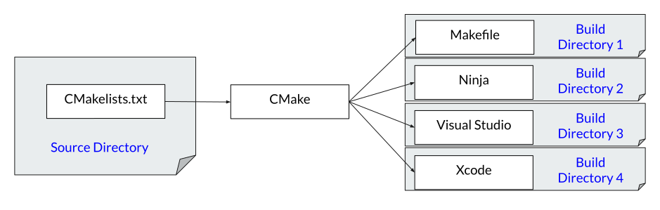

[Part 1] discussed a few basic concepts related to build systems. Part 2
focuses on how one can use CMake to accomplish the goals described in Part 1.

There are __many__ good CMake tutorials out there, but their aim is usually to
teach through practical examples. As part 1 demonstrated, I want to take a more
fundamental approach, and focus on the concepts rather than on their
implementation or detailed explanations about particular CMake functions. Once
the fundamentals are understood, other tutorials, talks and documentation will
make a lot more sense. I will link some useful resources that can be used to
take this to the next level.

The first order of business is to clarify a small lie that has been told.

## CMake is not a build system.

Strictly speaking, CMake is a build system _generator_. In other words, CMake
reads the project description and, instead of building the project, it simply
generates build description files for a [build system of your choice]. In other
words, CMake by itself is not enough to build a project.



As the picture shows, CMake will place the build system description file
(Makefile, build.ninja, etc) inside the _build directory_. It might seem odd at
first, but it makes sense if one views the build system as a property of a
particular build, not as a property of the project itself. For example, a build
on Windows will likely use a different build system than a build on Mac.

Consider, for instance, a project based exclusively on the ninja system. A
Windows developer who wants to work on this project and use Visual Studio would
have to hope Visual Studio has support for Ninja. The same applies for
Mac/Xcode, or any other platform. Alternatively, the project can use CMake and
generate native Visual Studio / Xcode build descriptions for those builds.

## The canonical CMake invocation

To start a CMake-based build, gather the following information:

1. The source directory path, `$SOURCE_DIRECTORY`.
2. The build directory path, `$BUILD_DIRECTORY`.
3. The desired build system, `$BUILD_SYSTEM`. (`Ninja`, `Unix Makefiles`, etc)

Then, run:

```bash
cd $BUILD_DIRECTORY
cmake [-G $BUILD_SYSTEM] $SOURCE_DIRECTORY
```

Those steps generate the required files inside the build directory. To build,
either run the build system specific command inside the build directory
(`make`, `ninja`, etc) or let CMake abstract this in a system-agnostic way:

```bash
cmake --build $BUILD_DIRECTORY
```

## CMakeLists.txt files

A CMake-based project will contain many CMakeLists.txt files throughout its
directory hierarchy. These files contain a description of each module
(_target_) in the project and their relationship (_properties_); it is the
programmer's goal to express those ideas as cleanly as possible using the
_CMake language_.

## The CMake language

The CMake language is just a programming language, it has functions, loops,
conditionals, etc.  It also has its quirks and oddities. Like any language, it
is merely a tool to express intent, and getting the basics right is crucial to
writing expressive code.

It's impossible to fully describe the language in a blog, but there is one key
concept that needs to be explained.

### Strings, string everywhere!

In the CMake language, almost everything is a string. The contents of a
variable is a string, the variable name itself is a string. Here's how one
would write an assignment command:

```CMake
set(my_var hello)
```

The mental model I use when thinking about the CMake language is that
"assignment to a variable creates a map from a string to another". In other
words:

```c++
map["my_var"] = "hello";
```

Dereferencing a variable is done with the `${}` operator:

```CMake
${my_var}
```

We can think of it simply querying the map:

```c++
map["my_var"]
```

### Go crazy

Convince yourself you understand what these lines are doing:

```CMake
set(hello_str hello)                 # map[“hello_str”] = “hello”
set(world_str world)                 # map[“world_str”] = “world”
set(helloworld “Hello world!”)       # map[“helloworld”] = “Hello world!”
${hello_str}                         # Queries map[“hello_str”] finds “hello”
${${hello_str}}                      # Queries map[“hello”]... empty!
${${hello_str}${world_str}}          # Queries map[“helloworld”] finds “Hello world!”
```

### A word on whitespaces

Whitespaces separating two strings cause those strings to be interpreted as a
list, internally represented as a semicolon-separated concatenation of the
strings.

```CMake
set(my_var hello world)              # map[“my_var”] = “hello;world”
set(my_var hello;world)              # same as above.
set(my_var “hello world”)            # map[“my_var”] = “hello world”
```

## Targets

In CMake, a `target` is anything one wants to build. It is typically an
executable or a library, but it's possible to define any custom set of
commands.

```CMake
add_executable(
  executable1
    executable1_source.cpp
)

add_library(
  library1
    library1_source.cpp
)
```

## Properties

Properties provide information on `targets`. There are three flavors of properties:

* Private: information about __how__ the target does something. Other targets
need not be aware of private properties.
* Interface: information about __what__ the target does. Other targets need to
know about interfaces.
* Public: information that is both private and on the interface.

Let's look at one such property: include directories. This specifies include
paths the compiler should use when looking for header files.

```CMake
target_include_directories(
  library1
    PRIVATE /my/private/path
    PUBLIC /my/public/path
)
```

Note the two distinct paths specified above. The `PRIVATE` path will not be
visible to any other targets using `my_lib1`, whereas the `PUBLIC` path will.
To understand this, let's look at the link libraries property:

```CMake
target_link_libraries(
  executable1
    PRIVATE library1
)
```

This expresses that `executable1` needs to be linked against `library1`.
Furthermore, `executable1` also depends privately on everything that is part of
`library1`'s interface. In particular, the `/my/public/path` include path will
also be visible to `executable1`.


## Visual representation

Targets are the building blocks of a CMake project description and properties
tell CMake how to build targets. Linking targets cause properties to flow from
one target to another transitively and create dependencies that define an order
in which actions must happen at build time.

The dependency between targets and the flow of properties can be visualized by
passing ``--graphviz=<some_prefix>`` to the CMake command call. It will cause
CMake to generate a DOT graph file that can be plotted to generate something
like this:


If you can (easily) produce such a graph for your project, you have a clear
understanding of the project as a whole.


## Conclusion

At the end of part 1, we concluded by listing some symptoms of bad build systems.
Let's see how a CMake-based project handles those issues.

> How easy is it to spawn a second build from the same source directory?

Simply create a new empty build directory and rerun the CMake configure command.

> How easy is it to identify files that must be under version control?

A file must be under version control if and only if it is inside the source
directory.

> Can you identify the compiler that is used in a given build? How easily can
that be changed?

The CMake command prints out the C and C++ compilers detected as part of the
configure command. A different compiler may be used by passing extra flags to
the configure command: `-DCMAKE_CXX_COMPILER=path/to/c++/compiler` and
`-DCMAKE_C_COMPILER=path/to/c/compiler`. The `cmake-gui` tool (shipped with CMake)
allows inspection of the current configuration of a given build directory.

> Can you build a single component of the project and its dependencies,
without building anything unnecessary?

Yes, just run `cmake --build $BUILD_DIRECTORY --target <target_name>`.

> If a source file is changed, how easy is it to incrementally build the
affected components?

Simply rerun `cmake --build $BUILD_DIRECTORY`.

-----

Here I stop, having taken you from the basics of building to the fundamentals
of CMake, with the hopes that you'll find other tutorials much more palatable
than they were for me. There are suggestions below if you want to continue your
journey on this world of building software; knowing how to build existing
projects and how to start new ones is a useful skill to have. If you want to
stop, I don't blame you. It is no easy road.

-----

## Further reading

* The [CMake documentation] is really good and comprehensive, I use it a lot
and it rarely disappoints. Learn how to navigate this and interpret the docs
and you'll be able to understand new commands and functions much faster (this
is a general advice for any software). For example, read the _Normal libraries_
section of the [add\_library] documentation, a command we used in this
tutorial.

* The "official" [CMake tutorial] covers a __lot__ of material. As such, it is
a good way to survey everything that can be done with CMake, without going into
too much detail. You should be able to follow it having read these two blog
posts.

* Craig Scott's [Professional CMake] book is great both as a learning tool
and as a reference. Whenever I find myself thinking _How do I do X again?_ or
_I'm sure there is a better way to this_, this book comes to the rescue.  It
was also my primary way to learn about CMake.

* Daniel Pfeifer's [Effective CMake] talk is a good introduction to the CMake
language and to good CMake practices. The second half of the talk is pretty
heavy on details though, so don't worry too much about it right now.

[Part 1]: http://felipepiovezan.gitlab.io/blog/build_system_basics/
[build system of your choice]: https://cmake.org/cmake/help/latest/manual/cmake-generators.7.html#cmake-generators
[CMake documentation]: https://cmake.org/cmake/help/v3.17/
[CMake tutorial]: https://cmake.org/cmake/help/latest/guide/tutorial/index.html
[Professional CMake]: https://crascit.com/professional-cmake/
[add\_library]: https://cmake.org/cmake/help/latest/command/add_library.html#normal-libraries
[Effective CMake]: https://www.youtube.com/watch?v=bsXLMQ6WgIk
