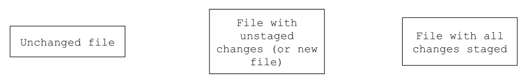
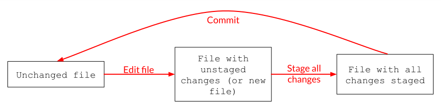
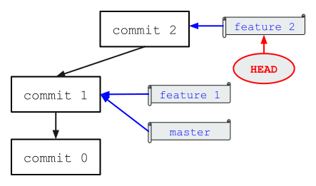
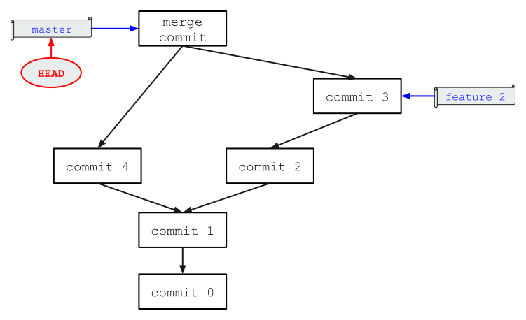
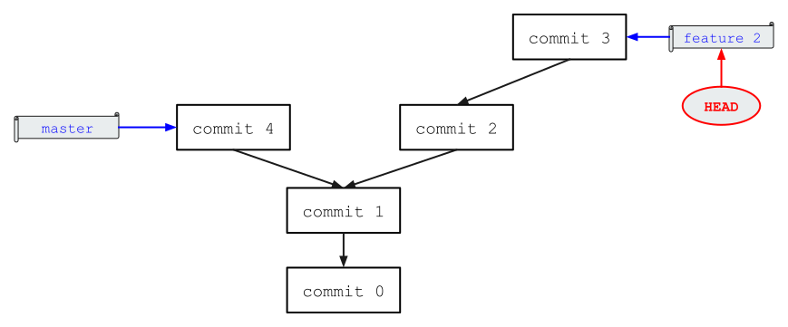
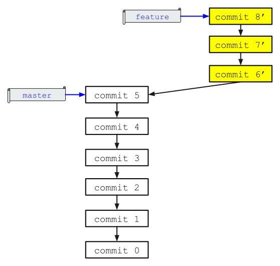
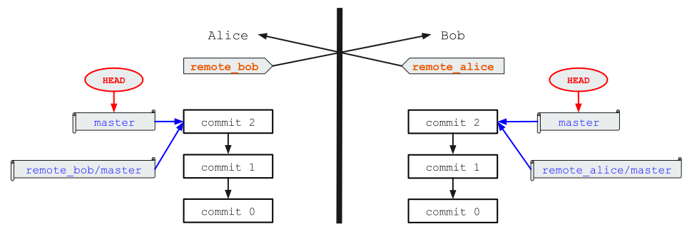
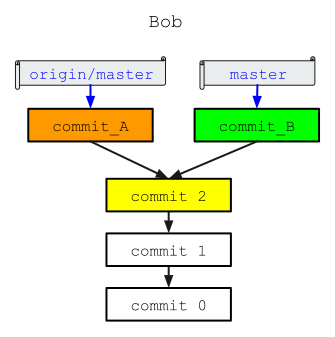

Using Git is a mandatory skill for any software engineer in today's industry,
but it's surprisingly difficult to find an introduction to the mental model
behind Git. Most Git users repeat a set of memorized commands that work for
some situations, resorting to colleagues when the cheat sheet fails.

I used to be in that camp before opening the magic box behind the command line
interface. Having understood Git's conceptual model, I am now able to use the
tool more effectively than before, employing it in ways that I didn't know were
possible. By framing a problem as an operation on the commit history graph, I
can easily find the Git command I need to solve it.

With this post, I intend to go over Git's conceptual model *without
mentioning a single command-line operation*. Once the model is clear, then we
look at daily actions performed by developers and map those actions to Git
concepts. This is my attempt at "how I wish Git had been explained to me".

# Saving snapshots of the project

At its core, a version control system is a program that keeps track of the
state of a repository as it evolves through time. It allows us to go back and
forth between states, to record new states, and to inspect the "history" of the
repository.

In Git, saving a new state of the repository consists of:

1. Making changes to files or adding new ones.
2. Specifying which changes should be recorded by adding those changes to the
*staging area*.
3. Performing a *commit* operation.

For now, don't worry about what this commit operation is, we'll talk about it
soon.

## Staging

The staging area consists of a set of changes that will be included by the next
commit operation. It partitions the repository into three categories of files:

During development, we are editing files, staging *changes*, and finally doing a
commit operation:

Nothing stops us from editing a file, staging it and editing the file again;
this effectively creates a new kind of file that has both staged and unstaged
changes. It's up to us to decide what we want the next commit to include: if
it should include the new changes, then we have to stage them too.

Git also allows us to stage *some* of the changes in a file, in fact the mental
model is that we stage changes done to a file, not the file itself. Staging
only a subset of the changes done to a file is helpful in case they don't all
logically belong on the same commit.

## Commit definition

So what is a commit operation?

When a commit is performed, *a snapshot of the entire repository is taken* and
stored into an internal data structure of Git. A commit operation creates a
commit object, which consists of:

1. A pointer to that snapshot,
2. the author's name and email,
3. a commit message, and
4. pointer to the commit that came directly before this commit.

By pointer we mean a SHA-1 hash of the object; it is common to refer
to a commit by its hash.

Note: if any of the items above is changed, the commit hash will change too!

Unfortunately, the verb "commit"  and the noun "commit" are the spelled the
same way in English; when we use it as a verb, we mean the act of perfoming a
commit operation, whereas the noun refers to the commit object (or its hash).

## How a sequence of commits form a graph

Because a commit stores a reference to the preceding commit, in other other
words, because a commit has a parent, the repository can be represented as a
directed acyclic graph: nodes are commits and a directed edge `(commit2, commit1)` indicates
that commit `commit1` is a parent of `commit2`.

For ease of representation, I'm using names for the commits in the pictures,
but `commit1` and `commit2` actually represent the hash of the respective
commits.

## Branches: a name and a pointer

The concept of a *branch* is what allows us to navigate through important states
of a repository. A branch in Git is a pair `(name, pointer to a commit)`.

In this example, we have two branches named `feature1` and `master`, both
pointing to commit `commit1`, and a branch named `feature2` pointing to
`commit2`.

Note: there is nothing special about the branch named `master`. When you create
a repository from scratch, you need a name for the starting branch -- `master`
is the default and few repositories bother renaming it.

## You are where your HEAD is.

Since we're jumping around the history of the repository all the time, how do
we know which snapshot we're looking at? This information is tracked by a
special pointer, called `HEAD`. Most of the time, `HEAD` points to a branch:

In this example, we are looking at the repository as defined by branch
`feature2`, which points to `commit2`.

When we add a new commit, we advance the branch pointed by the `HEAD`:

## A word on detached `HEADS`

What if we want to inspect snapshots that are not pointed to by any
branch, like `commit2`? You can use its hash and force `HEAD` to point to it:

You are now in what is called a *detached  `HEAD` state*, that is, `HEAD` is
not following any branches. This is not what you'll be doing 99.99% of the
time and, once in a detached `HEAD` state, you'll either create a new branch
pointing to the current snapshot, or switch to some other branch; both of those
actions restore your `HEAD` to its natural state: that of tracking branches.

## Change branches often...

Changing a branch is simple: just point your `HEAD` to it, and Git will
assemble the repository as it was in the commit pointed to by that branch.

## ... except when you can't

Changing branches is a natural operation that we perform often, but it has the
potential to overwrite non-committed changes.

For example, suppose you have edited `main.cpp` **but not committed those
changes** and suppose you attempt to change `HEAD` to `other_branch`.  However,
`main.cpp` is different in `other_branch`. What should happen to your
non-committed changes? Should Git discard them  and overwrite `main.cpp` with
the version in `other_branch`?

Git follows a principle that it will **never** allow you to lose changes by accident,
unless you are explicit about it by using dangerous keywords like "force" or
"hard".

In the example above, unless Git can *cleanly* and *unambiguously* apply the
non-committed changes on top of the target branch, it will NOT let you change
branches. In particular, you should be able to move back and forth between two
branches without any loss of information; if that's not possible, Git will not
let you change branches.

Merely staging the changes wouldn't be enough either. In other words: commit,
commit, commit, commit. Don't be afraid of committing, it is the most powerful
tool in your toolbox.

## The graph doesn't have to be linear

So far, our graph has always been a "straight line". However, what happens if
we add a new commit to `feature1` in the example shown previously? The graph
becomes more interesting:

Note that, because our head was pointing to the `feature1` branch, the next
commit advanced that branch.

## Deleting a branch deletes a name.

Because a branch is just a pointer, deleting it is a quick operation: just
delete the pointer. However...

### Git will not let you delete some branches.

What if deleting a branch would cause loss of information?

The canonical way to navigate between states of your repository is by
changing your HEAD so that it points to different branches, and that is done
through branch names; Git doesn't expect you to memorize hashes.

Consider this example:

If we delete the branch `feature2`, the commits in red would be lost forever:
there is no branch that includes those commits, i.e. there is no way to put
your repository in a state containing those commits[^1]. The only way to
inspect those commits would be if you memorized their hashes and moved into a
detached head state.

As such, Git will not let you delete that branch unless you force it to.

# Merging branches

We've seen what branches are and how they relate to commits. The next building
block to be examined is how to merge work from one branch into another. There
are many different ways to accomplish this, and the choice depends on what
you want the final commit history to look like.

## Easy merging: fast forward

Let's consider the scenario we had before:

Suppose the work from the `feature1` branch has been tested and is ready to be
merged back into `master`. To emphasize: we want to merge `feature1` into
`master`, not the other way around (more on this later). 

Well, lucky you, nobody has committed into master since the work on `feature1`
started! Because **all commits in `master` are also in `feature1`**, Git can
simply move the `master` pointer forward, a method known as a *fast forward*:

This method is always free of conflicts, that is, it will never require manual
intervention to resolve edits made in the same file on the two branches being
merged.

The `feature1` branch is now irrelevant and can be deleted:

## Non-trivial merges

When many developers are working on the same repository, chances are Git won't
always be able to fast-forward. Suppose the `feature2` branch from above is
ready to be merged back into master, what will happen?

### Three-way merge!

When fast forwards are not possible, Git will identify three commits to help it
perform the merge:

1. The commit pointed to by the destination branch.
2. The commit pointed to by the source branch.
3. The commit that is the lowest common ancestor of 1 and 2.

Using our previous example, the commits are as follows:

Using those commits, Git will now merge the two branches, identify conflicting
changes and create a new commit representing the merge:

If any conflicting changes are found, Git will ask you to resolve them before
the merge commit is created.

The `feature2` branch can now be deleted.

### Rebase!

A lot of projects frown upon complicated graphs for their main development
branches, as such, they forbid three-way merges. To maintain a clean and linear
history, a different procedure is needed.

Let's pretend we never did the three-way merge with `feature2`:

Instead of a three-way merge, we can re-apply commits from `feature2` on top of
`master`, this is known as a rebase of `feature2` on top of `master`.

1. Start with our `HEAD` on the source branch (`feature2`).
2. Git rewinds `HEAD` to the lowest common ancestor of the two branches.
3. Git forwards `HEAD` along the path of the target branch (`master`).

    

4. Git replays the commits of `feature2`.

    

If any commits can't be applied cleanly, Git asks for your intervention before continuing.

Note: the new commits are different from the original ones and they will have
different hashes. Why?[^2]

Now, if you switch HEAD to `master` and try to merge with `feature2`, a simple
fast forward will do!

### Keeping feature branches up-to-date with the main branch

When developing a big feature in a separate branch, it's wise to ensure our
code is up-to-date with the main branch of the project, otherwise we run the
risk of working on top of a stale version of the code base.

One way to accomplish this is by frequently merging the main branch into the
feature branch:

If your project disallows three way merges, you would frequently
rebase the feature branch on top of the main branch:

# Distributed Git

So far, everything we've covered assumes the entirety of development is
performed locally, that is, there are no copies of the repository outside our
machine. There are no pesky coworkers, no remote servers, nothing!

However, that's not how modern development is done. So how does Git handle
multiple developers?

## Remotes

A *remote* is just another copy of the same repository located elsewhere.
Git needs to know where and how to find it through an address and protocol:
ssh, https, file system path, etc.

Suppose Alice and Bob both have a copy of the same repository in their own
machines:

Now suppose Alice and Bob want to collaborate, thus they need the ability to
see what each other is up to. Alice will add a *remote* called `remote_bob` and
Bob will add a *remote* called `remote_alice`.

Both will then *fetch* updates from their remotes, resulting in the following
trees:

## Agreement on distributed systems is a hard problem

Because the copies are independent of each other, branches may evolve differently
in each remote. For instance, Alice and Bob might make different, independent commits
in their master branches:

Which version of master should be accepted as correct? The situation can get a
lot worse if you have many developers working at the same time. How are all
these developers supposed to agree on what the correct version of a branch
should be?

## Follow an origin

The typical way to solve this problem is by electing a *remote* to be the
correct copy of the repository, and letting developers try to influence it.
Usually, this remote is called `origin`.

Consider the situation we had before, where Alice and Bob had diverged on what
master should look like. Instead of interacting with each other's repository
directly, they only interact with `origin`:

(I'm omitting `HEAD` here to keep the diagram manageable.)

To publish their own versions of `master` to `origin/master`, Alice and Bob will
attempt to perform a *push* operation into their `origin` remote. Let's assume
that Alice performs her *push* first, resulting in the following scenario:

Notice how Bob doesn't yet know that `origin` has accepted Alice's update to
master. When Bob tries to push his `master` into `origin/master`, Git will tell
him: "I can't do this, because your `origin/master` is not what `origin` says
it should be. Do a *fetch* first!"

Once Bob fetches `origin`, this is what he sees:

Then Bob can either rebase `master` on top of `origin/master` or merge
`origin/master` into `master`. Now Bob is ready to *push* `master` to
`origin/master`.

Here's what the final result would look like if Bob had used the merge option:

## Origin with some interface

In the previous example, `origin` could only be changed by trying to `push`
updates to it. However, all pushes are rejected unless we have
the exactly same view of the branch being pushed to as `origin` does.

To fix this problem, it might be desirable to have `origin` itself run commands
on its copy of the repository and let downstream users -- like Alice and Bob --
get updates by fetching; this is what services that host a repository typically
provide.

For instance, Alice might create a new branch, do some work, commit, and push
this new branch to `origin`. This push will always work without issues, because
she's the only one working on it (barring any unlucky events where Bob created
a branch with the same name)

Alice can then go into the interface provided by `origin` - likely a webpage -
click a "create merge request" button, specifying `feature_alice` as the source
branch and `master` as the destination branch.  This will have the effect
of `origin` performing the merge on its side.

Note that Alice will not see the merge on her copy of the repository until she
performs a fetch.

If the merge can't be performed due to conflicts, the interface will let Alice
know.

# Conclusion

With the mental model clear, you'll have a much easier time with the command
line interface, as the terminology used in this article reflects what Git uses
for its commands and its manual. The next step is to start over, and match
each operation we discussed to its equivalent command. I've linked some
resources for further reading below.

Feel free to send me a message on Twitter if you feel like something isn't clear!

# Further reading

* Git has its own book called [Pro Git] and it's free! It is by far the best
resource I found while learning.

* If you're wondering how to use branches to effectively manage a project, I
recommend reading the following articles: [A successful Git branching model]
and the [Github guide].

[^1]: In fact, Git would permanently delete all contents
associated with those commits next time it tries to cleanup its internal data
structures.

[^2]: The new commits have different
parent commits, and if you had to solve any conflicts during the rebase, each
intermediate snapshot will be different.

[Pro Git]: https://git-scm.com/book/en/v2
[A successful Git branching model]: https://nvie.com/posts/a-successful-git-branching-model/
[Github guide]: https://guides.github.com/introduction/flow/
